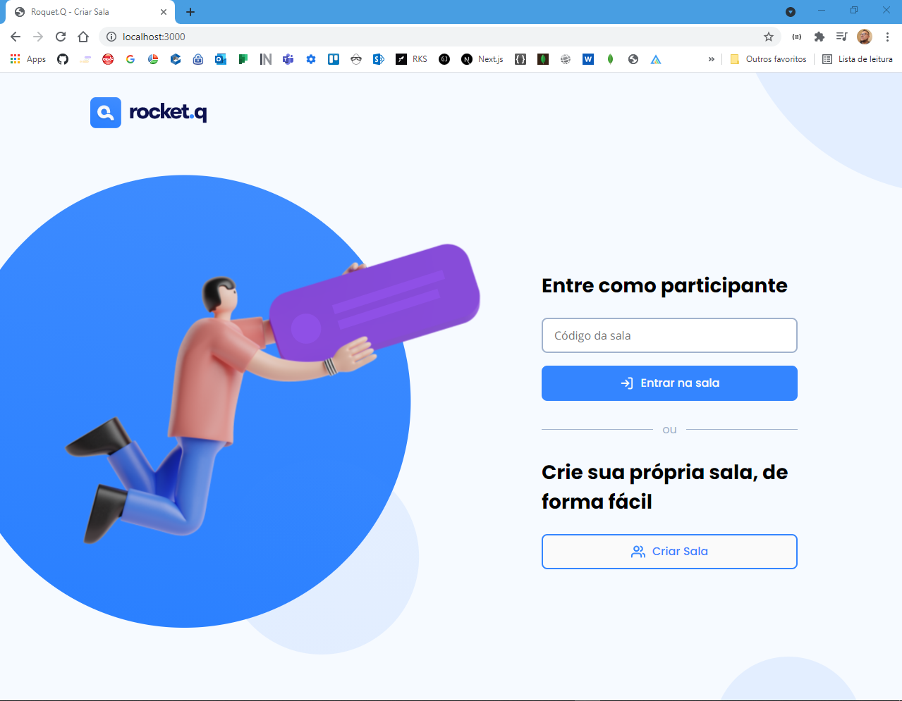

<h1 align="center">
  
</h1>

<p align="center">
  
</p>

---
## 🚀 techs
- 🔗 [NodeJs](https://nodejs.org/)
- 🔗 [Ejs](https://ejs.co/) 
- 🔗 [Sqlite](https://www.sqlite.org/) 
--- 

### 💻 Sobre o ROCKET.Q
Projeto desenvolvido para gerenciar perguntas anonimas de usuários direcionadas ao dono da página. Projeto desenvolvido na semana NLW Rocketseat na missão discover.

## getting started
```
- Clone este repositório
- npm install
- npm run init-db
- npm run start
```

### Author
Feito com ❤️ por Rafael Silva